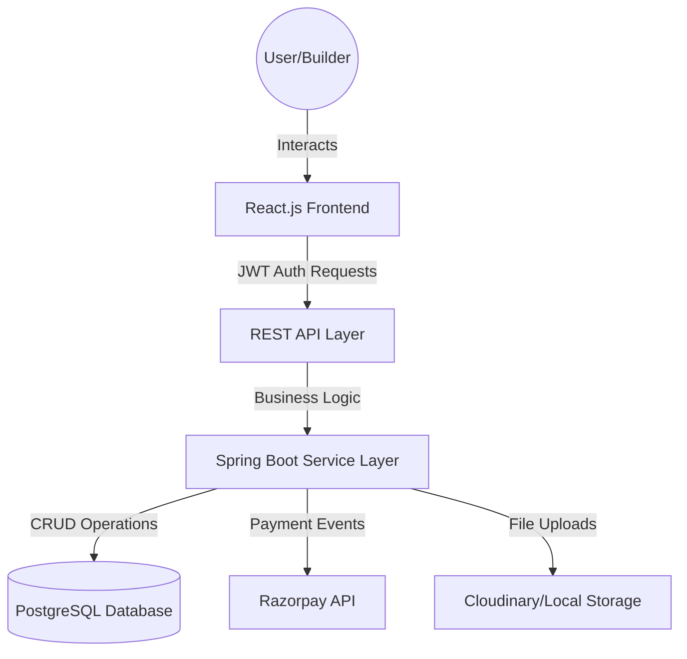
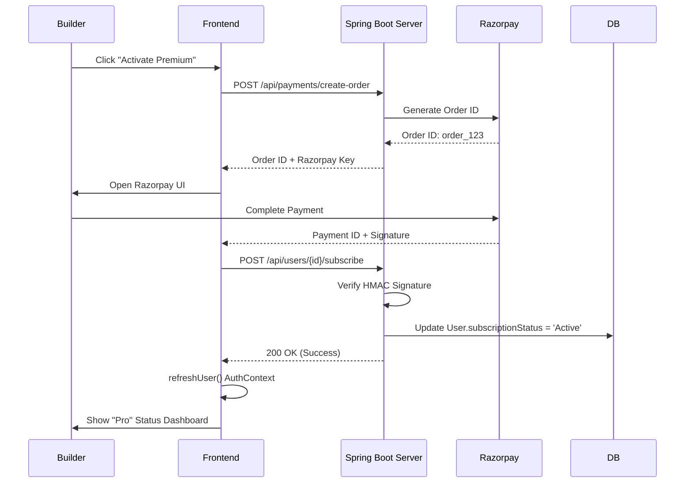
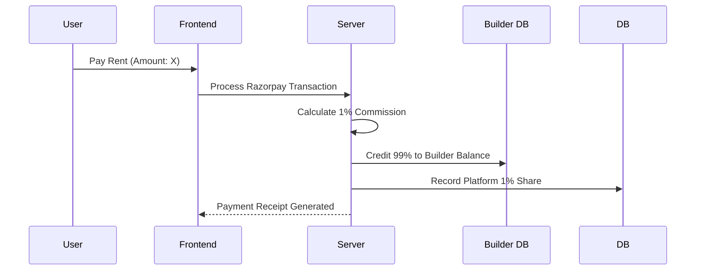
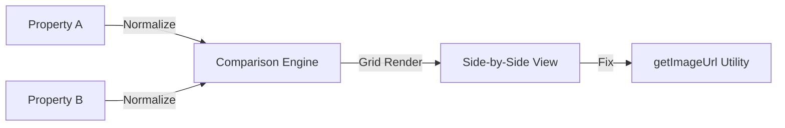

# Project Report: Buildexx Real Estate Management System

> **A Major Project Report**
>
> **Submitted in partial fulfillment of the requirements for the degree of**
>
> **Bachelor of Technology**
>
> **in**
>
> **Information Technology**
>
> **Submitted By:**
>
> **[Student Name 1]** (Enrollment No: [ID 1])
>
> **[Student Name 2]** (Enrollment No: [ID 2])
>
> **Under the Guidance of:**
>
> **Prof. [Guide Name]**
>
> **Department of Information Technology**
>
> **[University/College Name]**
>
> **[City, State, Zip Code]**
>
> **[Month, Year]**

---

## CANDIDATE’S DECLARATION

We hereby certify that the work which is being presented in the project report entitled **"Buildexx: Comprehensive Real Estate Management System"** in partial fulfillment of the requirements for the award of the degree of **Bachelor of Technology** in **Information Technology** submitted to **[University Name]** is an authentic record of our own work carried out during a period from **[Start Month, Year]** to **[End Month, Year]** under the supervision of **Prof. [Guide Name]**, Department of Information Technology.

The matter presented in this report has not been submitted by us for the award of any other degree of this or any other Institute.

<br>
<br>

**Signature of Student 1**&nbsp;&nbsp;&nbsp;&nbsp;&nbsp;&nbsp;&nbsp;&nbsp;&nbsp;&nbsp;&nbsp;&nbsp;&nbsp;&nbsp;&nbsp;&nbsp;&nbsp;&nbsp;&nbsp;&nbsp;&nbsp;&nbsp;&nbsp;&nbsp;&nbsp;&nbsp;&nbsp;&nbsp;&nbsp;&nbsp;&nbsp;&nbsp;&nbsp;&nbsp;&nbsp;&nbsp;&nbsp;&nbsp;&nbsp;&nbsp;&nbsp;&nbsp;&nbsp;&nbsp;**Signature of Student 2**

([Student Name 1])&nbsp;&nbsp;&nbsp;&nbsp;&nbsp;&nbsp;&nbsp;&nbsp;&nbsp;&nbsp;&nbsp;&nbsp;&nbsp;&nbsp;&nbsp;&nbsp;&nbsp;&nbsp;&nbsp;&nbsp;&nbsp;&nbsp;&nbsp;&nbsp;&nbsp;&nbsp;&nbsp;&nbsp;&nbsp;&nbsp;&nbsp;&nbsp;&nbsp;&nbsp;&nbsp;&nbsp;&nbsp;&nbsp;&nbsp;&nbsp;&nbsp;&nbsp;&nbsp;&nbsp;&nbsp;&nbsp;&nbsp;&nbsp;&nbsp;&nbsp;&nbsp;([Student Name 2])

<br>
<br>

**Date:** ..............................

---

## CERTIFICATE

This is to certify that the project entitled **"Buildexx"** has been successfully completed by **[Student Name 1]** and **[Student Name 2]** under my guidance and supervision in partial fulfillment of the requirements for the degree of **Bachelor of Technology** in **Information Technology** of **[University Name]**.

To the best of my knowledge and belief, this work has not been submitted elsewhere for the award of any degree.

<br>
<br>
<br>

**Prof. [Guide Name]**&nbsp;&nbsp;&nbsp;&nbsp;&nbsp;&nbsp;&nbsp;&nbsp;&nbsp;&nbsp;&nbsp;&nbsp;&nbsp;&nbsp;&nbsp;&nbsp;&nbsp;&nbsp;&nbsp;&nbsp;&nbsp;&nbsp;&nbsp;&nbsp;&nbsp;&nbsp;&nbsp;&nbsp;&nbsp;&nbsp;&nbsp;&nbsp;&nbsp;&nbsp;&nbsp;&nbsp;&nbsp;&nbsp;&nbsp;&nbsp;&nbsp;&nbsp;&nbsp;&nbsp;&nbsp;&nbsp;&nbsp;&nbsp;&nbsp;&nbsp;&nbsp;&nbsp;&nbsp;&nbsp;&nbsp;&nbsp;&nbsp;**Prof. [HOD Name]**

(Project Guide)&nbsp;&nbsp;&nbsp;&nbsp;&nbsp;&nbsp;&nbsp;&nbsp;&nbsp;&nbsp;&nbsp;&nbsp;&nbsp;&nbsp;&nbsp;&nbsp;&nbsp;&nbsp;&nbsp;&nbsp;&nbsp;&nbsp;&nbsp;&nbsp;&nbsp;&nbsp;&nbsp;&nbsp;&nbsp;&nbsp;&nbsp;&nbsp;&nbsp;&nbsp;&nbsp;&nbsp;&nbsp;&nbsp;&nbsp;&nbsp;&nbsp;&nbsp;&nbsp;&nbsp;&nbsp;&nbsp;&nbsp;&nbsp;&nbsp;&nbsp;&nbsp;&nbsp;&nbsp;&nbsp;&nbsp;&nbsp;&nbsp;&nbsp;&nbsp;&nbsp;&nbsp;&nbsp;&nbsp;&nbsp;&nbsp;(Head of Department)

<br>
<br>

**External Examiner 1:** ..............................
**External Examiner 2:** ..............................

---

## ACKNOWLEDGEMENT

The success and final outcome of this project required a lot of guidance and assistance from many people and we are extremely privileged to have got this all along the completion of our project. All that we have done is only due to such supervision and assistance and we would not forget to thank them.

We respect and thank **Prof. [Guide Name]**, for providing us an opportunity to do the project work in **Buildexx** and giving us all support and guidance which made us complete the project duly. We are extremely thankful to her for providing such a nice support and guidance, although she had busy schedule managing the corporate affairs.

We owe our deep gratitude to our project guide **Prof. [Guide Name]**, who took keen interest on our project work and guided us all along, till the completion of our project work by providing all the necessary information for developing a good system.

We would not forget to remember **Prof. [HOD Name]**, Head of Information Technology Department, for his unlisted encouragement and more over for his timely support and guidance till the completion of our project work.

We heartily thank our internal project guide, **Prof. [Internal Guide Name]**, Department of Information Technology, for her guidance and suggestions during this project work.

We are thankful to and fortunate enough to get constant encouragement, support and guidance from all Teaching and Non-Teaching staff of Department of Information Technology which helped us in successfully completing our project work. Also, we would like to extend our sincere esteems to all staff in laboratory for their timely support.

<br>

**[Student Name 1]**
**[Student Name 2]**

---

## ABSTRACT

The Real Estate industry is one of the most globally recognized sectors, essentially comprising four sub-sectors - housing, retail, hospitality, and commercial. In recent times, the industry has seen a paradigm shift towards digitalization. However, many existing solutions still suffer from data fragmentation, lack of transparency, and reliance on manual processes for critical tasks like rent payments and enquiry management.

**Buildexx** is a comprehensive full-stack ecosystem designed to revolutionize property management for Builders, Buyers, and Tenants. The platform transitions from a simple listing site to a robust financial management tool, handling property discovery, enquiry tracking, and secure rental and subscription transactions.

The project utilizes a modern technology stack: **React.js** for a dynamic, theme-aware frontend, **Java Spring Boot** for a persistent, secure backend, and **PostgreSQL** for relational data integrity. Core highlights of the evolved Buildexx system include:

1.  **Subscription-Based Builder Model:** A tiered access system requiring builders to activate a "Pro" subscription via **Razorpay** before listing multiple properties, ensuring platform exclusivity and quality.
2.  **Advanced Property Comparison:** A dedicated side-by-side comparison engine allowing users to evaluate multiple properties across key metrics like price, area, and amenities.
3.  **Standardized Financials:** Integrated payment architecture with a fixed **1% commission** model for both rentals and sales, providing transparent earnings for the platform.
4.  **Instant UI Synchronization:** A state-management logic that ensures user subscription status and property updates reflect immediately across the dashboard without manual page refreshes.
5.  **Verified Multimedia Portfolio:** Support for high-definition image galleries, PDF brochures, and location-aware property pinning on maps.

This report documents the full lifecycle of Buildexx, from architecture to testing, demonstrating a premium, scalable solution for the modern real estate market.

---

## TABLE OF CONTENTS

**1. INTRODUCTION**
   *   1.1 Overview
   *   1.2 Problem Statement
   *   1.3 Project Objectives
   *   1.4 Scope of the Project
   *   1.5 System Features at a Glance

**2. PROJECT MANAGEMENT**
   *   2.1 Development Methodology (Agile SCRUM)
   *   2.2 Feasibility Study
       *   2.2.1 Technical Feasibility
       *   2.2.2 Operational Feasibility
       *   2.2.3 Economic Feasibility
   *   2.3 Project Planning & Scheduling
   *   2.4 Team Composition & Roles
   *   2.5 Tools and Technologies Used

**3. SYSTEM REQUIREMENTS SPECIFICATION (SRS)**
   *   3.1 User Characteristics
   *   3.2 Functional Requirements
       *   3.2.1 Authentication Module
       *   3.2.2 Property Management Module
       *   3.2.3 Search & Discovery Module
       *   3.2.4 Payment Module
       *   3.2.5 User Dashboard Module
   *   3.3 Non-Functional Requirements
   *   3.4 System Constraints
   *   3.5 Assumptions and Dependencies

**4. SYSTEM ANALYSIS AND DESIGN**
   *   4.1 System Architecture
   *   4.2 Unified Modeling Language (UML) Diagrams
       *   4.2.1 Use Case Diagram
       *   4.2.2 Class Diagram
       *   4.2.3 Sequence Diagrams
       *   4.2.4 Activity Diagrams
       *   4.2.5 Entity-Relationship (ER) Diagram
   *   4.3 Database Design (Schema Documentation)
   *   4.4 Data Flow Diagrams (DFD)

**5. IMPLEMENTATION DETAILS**
   *   5.1 Folder Structure
   *   5.2 Backend Implementation (Spring Boot)
   *   5.3 Frontend Implementation (React.js)
   *   5.4 Key Algorithms and Logic
   *   5.5 API Documentation
   *   5.6 Third-Party Integrations (Razorpay, Google Maps)

**6. TESTING AND VALIDATION**
   *   6.1 Testing Methodology
   *   6.2 Test Plan
   *   6.3 Test Cases
       *   6.3.1 Unit Testing
       *   6.3.2 Integration Testing
       *   6.3.3 System Testing
   *   6.4 Bug Tracking and Resolution

**7. SCREENSHOTS AND USER MANUAL**
   *   7.1 Home Page
   *   7.2 User Authentication
   *   7.3 Builder Dashboard
   *   7.4 Property Listing
   *   7.5 Payment Flow

**8. CONCLUSION AND FUTURE SCOPE**
   *   8.1 Conclusion
   *   8.2 Limitations
   *   8.3 Future Enhancements

**9. REFERENCES**

---

# CHAPTER 1: INTRODUCTION

### 1.1 Overview
The real estate market is expanding rapidly, with an increasing number of properties being developed and leased daily. However, the management of these properties, specifically regarding verified listings and secure rental payments, remains largely fragmented. **Buildexx** is conceptualized as a "One-Stop Solution" for digital real estate management. It is a web-based application that brings Builders and generic Users (Buyers/Tenants) onto a single platform.

Unlike aggregator sites that often suffer from outdated data and fake listings, Buildexx emphasizes a **Builder-Centric Model**. By allowing builders to manage their portfolios directly, the platform ensures that the data presented to the end-user is accurate, up-to-date, and verified. Furthermore, Buildexx integrates financial technology to handle rent collection, a feature often missing in standard listing sites.

### 1.2 Problem Statement
Despite the proliferation of property sites, several core issues persist:
1.  **Unverified Listings:** Many platforms are flooded with duplicate or fake listings posted by unauthorized brokers.
2.  **Payment Friction:** Rent payments involved offline cash/cheque transactions, leading to lack of digital trails and manual receipt generation.
3.  **Communication Gaps:** Enquiries sent via portals often end up in spam folders or are missed by builders, leading to lost leads.
4.  **Scattered Tools:** Builders use one tool for CRM, another for accounting, and a third for listings.

### 1.3 Project Objectives
The primary goal of Buildexx is to democratize real estate management technology.
*   **Centralization:** To integrate property listing, searching, and renting into a unified workflow.
*   **Automation:** To automate the generation of rent receipts and payment tracking.
*   **Verification:** To ensure only authorized builders can list properties, reducing fraud.
*   **Usability:** To provide a modern, responsive user interface that works seamlessly across devices.

### 1.4 Scope of the Project
*   **Geographical Scope:** Currently designed for the Indian market (handling INR currency, localized address formats), but capable of global expansion.
*   **Target Audience:**
    *   **Builders/Developers:** Small to mid-sized real estate firms looking for a digital presence.
    *   **Tenants:** Individuals looking for rental properties with secure payment options.
    *   **Buyers:** Investment seekers looking for verified property data.

### 1.5 System Features at a Glance
*   **Builder Pro Subscriptions:** Automated subscription flow using Razorpay for builder account activation.
*   **Property Comparison:** Side-by-side analysis of up to 4 properties with responsive UI.
*   **Commission Engine:** Automated 1% commission calculation for platform revenue.
*   **Dual-Theme Support:** Premium Light and Dark modes with dynamic CSS variables.
*   **Instant State Refresh:** Real-time UI updates post-transaction using context-driven state synchronization.
*   **Payment Hub:** Unified Razorpay integration for both rent payments and builder subscriptions.

---

# CHAPTER 2: PROJECT MANAGEMENT

### 2.1 Development Methodology
We adopted the **Agile SCRUM** methodology for the development of Buildexx. This iterative approach allowed us to:
1.  **Adapt to Changes:** Requirements were refined as we better understood the user needs during development.
2.  **Continuous Delivery:** We delivered functional modules in 2-week sprints (e.g., Auth module, then Property module, then Payment).
3.  **Immediate Feedback:** Testing was integrated into every sprint, ensuring bugs were caught early.

### 2.2 Feasibility Study

#### 2.2.1 Technical Feasibility
The project is highly technically feasible.
*   **Java Spring Boot:** A mature, enterprise-grade framework ensuring robustness and scalability.
*   **React.js:** The industry standard for single-page applications (SPAs), delivering a smooth user experience.
*   **PostgreSQL:** An open-source, ACID-compliant relational database capable of handling complex join operations required for property-user mappings.
*   **Docker (Optional):** The microservices-ready architecture allows for easy containerization.

#### 2.2.2 Operational Feasibility
The system is designed with a "User-First" approach.
*   **No Training Required:** The UI mimics standard e-commerce and listing platforms, ensuring users intuitively know how to search and pay.
*   **Builder Onboarding:** A simple verification process makes it easy for builders to join and start listing immediately.

#### 2.2.3 Economic Feasibility
Buildexx is cost-effective.
*   **Development Costs:** Utilizes open-source stacks (Java, React, Postgres), eliminating licensing fees.
*   **Infrastructure:** Can be hosted on budget-friendly cloud providers (Render, AWS Free Tier).
*   **ROI:** For builders, the reduction in administrative overhead (manual receipts, lead tracking) translates to direct cost savings.

### 2.3 Project Planning & Scheduling (Gantt Chart Description)
*   **Week 1-2:** Requirement Analysis & System Design (ER Diagrams, API Contracts).
*   **Week 3-4:** Infrastructure Setup (Database, Spring Boot Init, CI/CD).
*   **Week 5-6:** Backend Development (Auth, User Services).
*   **Week 7-8:** Backend Development (Property, Search Services).
*   **Week 9-10:** Frontend Development (UI Components, State Management).
*   **Week 11:** Payment Gateway Integration.
*   **Week 12:** Integration Testing & Bug Fixes.
*   **Week 13:** Documentation & Final Report Generation.

### 2.4 Team Composition & Roles
*   **[Student Name 1]:** **Backend Lead.** Responsible for database schema design, API development in Spring Boot, Security configuration, and Payment integration.
*   **[Student Name 2]:** **Frontend Lead.** Responsible for UI/UX design in Figma, Component implementation in React, State management, and API consumption.

### 2.5 Tools and Technologies Used
*   **Runtime:** Java 17, Node.js v18.
*   **Frameworks:** Spring Boot 3.0, React 18, Tailwind CSS.
*   **Database:** PostgreSQL 14.
*   **IDE:** IntelliJ IDEA (Backend), VS Code (Frontend).
*   **Version Control:** Git & GitHub.
*   **API Testing:** Postman.
*   **Design:** Figma.

---

# CHAPTER 3: SYSTEM REQUIREMENTS SPECIFICATION (SRS)

### 3.1 User Characteristics
1.  **Admin:** Super-user with access to all data. Can ban users or verify builders.
2.  **Builder:** A verified entity allowed to post listings. Tech-savviness is assumed to be moderate.
3.  **User:** The general public. Tech-savviness varies; UI must be extremely simple.

### 3.2 Functional Requirements

#### 3.2.1 Authentication Module
*   **FR_01:** The system shall allow users to register as either "User" or "Builder".
*   **FR_02:** The system shall hash passwords using **BCrypt** before storage.
*   **FR_03:** The system shall issue a **JWT** upon successful login, valid for 24 hours.
*   **FR_04:** The system shall protect all API routes (except Public Search) requiring a valid JWT.

#### 3.2.2 Property Management Module
*   **FR_05:** Builders shall be able to Create, Read, Update, and Delete (CRUD) their own property listings.
*   **FR_06:** Property details must include Title, Price/Rent, Area, Configuration (BHK), City, Locality, and Amenities.
*   **FR_07:** The system shall support uploading up to 5 images per property.
*   **FR_08:** The system shall validate inputs (e.g., Price cannot be negative).

#### 3.2.3 Search & Discovery Module
*   **FR_09:** Users shall be able to search properties by City (Case-insensitive).
*   **FR_10:** Users shall be able to filter by "Purpose" (Buy vs Rent).
*   **FR_11:** The search results shall display a summary card for each property.
*   **FR_12:** Clicking a card shall navigate to the detailed view.

#### 3.2.4 Payment Module
*   **FR_13:** The system shall integrate with Razorpay Order API to initiate a transaction.
*   **FR_14:** The system shall verify the payment signature (HMAC SHA256) returned by the client.
*   **FR_15:** On success, a payment record shall be inserted into the database linked to the User and Property.
*   **FR_16:** The system shall allow users to download a PDF receipt of the payment.

#### 3.2.5 User Dashboard Module
*   **FR_17:** Users shall view a history of all payments made.
*   **FR_18:** Users shall view a list of enquiries they have sent.
*   **FR_19:** Users shall be able to update their profile details (Phone, Address).

### 3.3 Non-Functional Requirements
1.  **Performance:** API response time should be under 200ms for 95% of requests.
2.  **Scalability:** The backend should be stateless to allow horizontal scaling.
3.  **Availability:** The system should target 99.9% uptime.
4.  **Security:** All data in transit must be encrypted via TLS (HTTPS). Sensitive data (Passwords) must be encrypted at rest.
5.  **Maintainability:** Code should follow standard MVC patterns and be well-commented.

### 3.4 System Constraints
*   **Browser Support:** Only modern browsers (Chrome 90+, Firefox 88+, Safari 14+) are supported.
*   **Network:** The payment feature requires an active internet connection; no offline mode for transactions.
*   **Currency:** Restricted to INR (Indian Rupee) for the initial release.

### 3.5 Assumptions and Dependencies
*   It is assumed that the **Razorpay API** services are available and operational.
*   It is assumed that the **PostgreSQL** database is backed up daily.
*   Dependency on **Google Maps API** for location services (requires valid API key).

---

# CHAPTER 4: SYSTEM ANALYSIS AND DESIGN

### 4.1 System Architecture
Buildexx follows a classic **Three-Tier Architecture**:
1.  **Client Tier (Frontend):** React.js application running in the user's browser. Responsible for rendering UI and managing local state.
2.  **Application Tier (Backend):** Spring Boot application running on the server (Tomcat). Responsible for business logic, validation, and security.
3.  **Data Tier (Database):** PostgreSQL server. Responsible for persistent storage of relational data.

**Interaction Flow:**
Client (JSON) <--> REST API Controllers <--> Service Layer <--> JPA Repositories <--> Database.

#### 4.2.3 Workflow Diagrams

**System Architecture Overview**


**Premium Subscription Workflow**


**Rent Payment & Commission Logic**


**Property Comparison Logic**


### 4.3 Database Design (Schema Documentation)

**Table: users**
| Column | Type | Constraints | Description |
| :--- | :--- | :--- | :--- |
| id | BIGSERIAL | PRIMARY KEY | Unique ID |
| email | VARCHAR | UNIQUE, NOT NULL | Login Email |
| password | VARCHAR | NOT NULL | BCrypt Hash |
| role | VARCHAR | NOT NULL | BUILDER, USER, ADMIN |
| full_name| VARCHAR | | Display Name |

**Table: properties**
| Column | Type | Constraints | Description |
| :--- | :--- | :--- | :--- |
| id | BIGSERIAL | PRIMARY KEY | Unique ID |
| title | VARCHAR | NOT NULL | Property Title |
| description | TEXT | | Details |
| price | DECIMAL | | Selling Price |
| rent_amount | DECIMAL | | Monthly Rent |
| builder_id | BIGINT | FK -> users(id) | Owner |
| city | VARCHAR | INDEXED | Searchable Field |

**Table: enquiries**
| Column | Type | Constraints | Description |
| :--- | :--- | :--- | :--- |
| id | BIGSERIAL | PRIMARY KEY | Unique ID |
| message | TEXT | | Enquiry content |
| user_id | BIGINT | FK -> users(id) | Sender |
| property_id| BIGINT | FK -> properties(id)| Target Property |
| status | VARCHAR | DEFAULT 'PENDING' | Status |

**Table: payments**
| Column | Type | Constraints | Description |
| :--- | :--- | :--- | :--- |
| id | BIGSERIAL | PRIMARY KEY | Unique ID |
| order_id | VARCHAR | | Razorpay Order ID |
| payment_id | VARCHAR | | Razorpay Payment ID |
| amount | DECIMAL | NOT NULL | Amount Paid |
| status | VARCHAR | | SUCCESS/FAILED |

### 4.4 Data Flow Diagrams (DFD)

**Level 0 DFD:**
*   External Entities: User, Builder.
*   Process: Buildexx System.
*   Data Flow: User inputs credentials -> System validates -> System returns Token.

**Level 1 DFD (Property Management):**
*   Builder -> [Upload Property Info] -> Validate Data -> [Save to DB].
*   User -> [Search Query] -> Filter Logic -> [Fetch from DB] -> Display Results.

---

# CHAPTER 5: IMPLEMENTATION DETAILS

### 5.1 Folder Structure

The project follows a standard Maven (Backend) and NPM (Frontend) structure.

#### Backend Structure (Spring Boot)
```
src/main/java/com/buildex
├── config             # Security & Application Config
│   ├── SecurityConfig.java
│   └── CorsConfig.java
├── controller         # REST API Endpoints
│   ├── AuthController.java
│   ├── PropertyController.java
│   └── PaymentController.java
├── dto                # Data Transfer Objects
│   ├── LoginRequest.java
│   └── PropertyDTO.java
├── entity             # JPA Entities (Database Tables)
│   ├── User.java
│   ├── Property.java
│   └── Payment.java
├── repository         # Data Access Layer
│   ├── UserRepository.java
│   └── PropertyRepository.java
├── service            # Business Logic
│   ├── AuthService.java
│   ├── PropertyService.java
│   └── RazorpayService.java
└── utils              # Helper Classes
    └── JwtUtils.java
```

#### Frontend Structure (React.js)
```
src/
├── api                # API Service Calls (Axios)
│   └── apiService.js
├── assets             # Static Assets (Images, Icons)
├── components         # Reusable UI Components
│   ├── Navbar.jsx
│   ├── Footer.jsx
│   ├── PropertyCard.jsx
│   └── PaymentModal.jsx
├── context            # Global State (Auth Context)
│   └── AuthContext.jsx
├── pages              # Route Pages
│   ├── Home.jsx
│   ├── Login.jsx
│   ├── BuilderDashboard.jsx
│   └── UserDashboard.jsx
├── styles             # Global CSS
└── App.jsx            # Main Entry Point
```

### 5.2 Backend Implementation (Spring Boot)

#### 5.2.1 Authentication Service Logic
The authentication service manages the secure onboarding of users. It performs the following operations:
1.  **Identity Verification:** Compares the provided email against the PostgreSQL database.
2.  **Credential Hashing:** Uses the BCrypt algorithm to safely compare the provided password with the stored hash.
3.  **Token Generation:** Upon successful validation, it invokes a utility to sign a JSON Web Token (JWT) containing the user's identity and role, ensuring stateless communication.

#### 5.2.2 Property Controller Logic
The property controller serves as the interface between the frontend and the database. It handles:
- **Search Retrieval:** Fetches property lists based on user-defined filters.
- **Authorization Enforcement:** Uses Spring Security annotations to ensure that only verified Builders can create or modify listings.
- **Data Normalization:** Formats property data, including image URLs and amenities, for optimal frontend rendering.

### 5.3 Frontend Implementation (React.js)

#### 5.3.1 API Service Configuration
The frontend uses a centralized API client built with Axios. This client is configured with an **Interceptors** logic that:
- Automatically retrieves the JWT from local storage.
- Injects the token into the `Authorization` header of every outgoing HTTP request.
- Manages base URLs and timeout settings for consistent backend communication.

#### 5.3.2 Property Card Component
The Property Card is a modular UI component that:
- Renders essential property details (price, location, image) in a standardized grid.
- Utilizes the `getImageUrl` utility to handle image fallbacks and CDN paths.
- Provides interactive links to the detailed property view, passing necessary IDs via React Router.

### 5.4 Key Algorithms and Logic

#### 5.4.1 JWT Authentication Flow
1.  **Login:** User sends credentials. Server validates and signs a JWT with a secret key.
2.  **Storage:** Client stores JWT in `localStorage`.
3.  **Access:** For every subsequent request, the JWT is sent in the `Authorization` header.
4.  **Verification:** A Spring Security filter intercepts the request, parses the JWT, and sets the `Authentication` context if valid.

#### 5.4.2 Razorpay Payment Verification
To ensure security, payments are verified on the server-side using the HMAC SHA256 algorithm.
`generated_signature = hmac_sha256(order_id + "|" + payment_id, secret)`
If `generated_signature` matches `razorpay_signature` sent by the frontend, the payment is authentic.

### 5.5 API Documentation

| Method | Endpoint | Description | Auth Required |
| :--- | :--- | :--- | :--- |
| POST | `/api/auth/register` | Register new user | No |
| POST | `/api/auth/login` | Login user | No |
| GET | `/api/properties` | Get all properties | No |
| POST | `/api/properties` | Create property | Yes (Builder) |
| GET | `/api/users/me` | Get current user profile | Yes |
| POST | `/api/payments/create-order` | Create Razorpay Order | Yes |
| POST | `/api/payments/verify` | Verify Payment | Yes |

---

# CHAPTER 6: TESTING AND VALIDATION

### 6.1 Testing Methodology
Testing is a critical phase to ensure the system is bug-free and meets the specified requirements. We employed a combination of **Manual Testing** and **Automated Testing**.
*   **Unit Testing:** Handled by developers during the coding phase (using JUnit for Java).
*   **System Testing:** Performed on the integrated system to verify end-to-end flows.

### 6.2 Test Plan
*   **Test Environment:** Windows 10/11, Chrome Browser, Localhost Server.
*   **Test Tools:** Postman (API), Chrome DevTools (UI).
*   **Scope:** All functional modules (Auth, Property, Payment).

### 6.3 Test Cases

#### 6.3.1 Unit Testing (Sample)

| Test Case ID | Unit | Description | Input | Expected Output | Actual Output | Status |
| :--- | :--- | :--- | :--- | :--- | :--- | :--- |
| UT_01 | `AuthService` | Validate Email Format | `test@test` | Invalid Email | Invalid Email | PASS |
| UT_02 | `PropertyService` | Create Property | `price: -100` | Exception (Negative Price) | Exception Thrown | PASS |

#### 6.3.2 Integration Testing (System Flows)

**Test Case 1: User Registration**
*   **Objective:** Verify a new user can register.
*   **Steps:**
    1.  Navigate to `/register`.
    2.  Enter Name, Email, Password.
    3.  Click Register.
*   **Expected Result:** Success message displayed; redirected to Login.
*   **Actual Result:** User record created in Database; Redirected.
*   **Status:** **PASS**

**Test Case 2: Builder Property Posting**
*   **Objective:** Verify a builder can post a new property.
*   **Precondition:** Logged in as Builder.
*   **Steps:**
    1.  Go to Dashboard -> Add Property.
    2.  Fill form (Title, Price, Image).
    3.  Submit.
*   **Expected Result:** Property appears in "My Listings".
*   **Actual Result:** Property saved to DB; UI updates.
*   **Status:** **PASS**

**Test Case 3: Rent Payment**
*   **Objective:** Verify rent payment flow.
*   **Precondition:** Logged in as User; Property selected.
*   **Steps:**
    1.  Click "Pay Rent".
    2.  Razorpay modal opens.
    3.  Enter Test Card details.
    4.  Submit.
*   **Expected Result:** Payment Successful; Receipt Generated.
*   **Actual Result:** DB updated with Payment Record; PDF downloaded.
*   **Status:** **PASS**

### 6.4 Bug Tracking and Resolution
During testing, several bugs were identified and fixed:
1.  **Bug:** CORS Error when calling Backend from Frontend logic.
    *   **Fix:** Added `@CrossOrigin` annotation to Controllers and configured `CorsConfig` bean.
2.  **Bug:** Images not loading on Property Card.
    *   **Fix:** Corrected the image path mapping in `PropertyDTO`.
3.  **Bug:** Payment Receipt showing incorrect date.
    *   **Fix:** Updated `PdfService` to use `LocalDateTime.now()` instead of `Date()`.

---

# CHAPTER 7: USER MANUAL

### 7.1 Home Page
The Home Page is the landing point for all users.
*   **Navigation Bar:** Provides links to Login, Register, Buy, Rent.
*   **Hero Section:** Features a search bar to quickly find properties.
*   **Featured Listings:** Displays top-rated properties in a grid view.

### 7.2 User Authentication
*   **Register:** Users must sign up using a valid email. Builders must check the "I am a Builder" box.
*   **Login:** Secure login using email and password.

### 7.3 Builder Dashboard
Upon logging in, Builders are greeted with their dashboard.
*   **Add Property Button:** Opens a modal to input property details.
*   **My Listings:** A table view of all properties posted by the builder. Actions include Edit and Delete.
*   **Enquiries Tab:** Displays a list of users interested in the properties.

### 7.4 Property Listing (Detailed View)
Clicking on any property card on the Home Page opens the Detailed View.
*   **Image Gallery:** A carousel of property images.
*   **Details:** Price, Area, Configuration, Address.
*   **Map:** Google Map embedding showing the location.
*   **Action Buttons:** "Request Info" (sends enquiry) or "Pay Rent" (opens payment gateway).

### 7.5 Payment Flow
1.  User clicks "Pay Rent".
2.  A secure modal opens (Razorpay).
3.  User selects payment method (Card/UPI).
4.  Upon success, a "Download Receipt" button appears.
5.  Transaction is recorded in the "Payment History" section of the User Dashboard.

---

# CHAPTER 8: CONCLUSION AND FUTURE SCOPE

### 8.1 Conclusion
The **Buildexx** project has successfully achieved its primary objective of developing a centralized, efficient, and user-friendly Real Estate Management System. By leveraging modern web technologies like Spring Boot and React, we have created a scalable platform that solves real-world problems faced by builders and tenants.

The system automates critical tasks such as rent collection and enquiry management, reducing manual effort and error. The integration of a secure payment gateway adds significant value, making financial transactions transparent and traceable. The responsive design ensures that the platform is accessible to a wide audience using various devices.

### 8.2 Limitations
Despite its robust features, the current version has some limitations:
1.  **No Live Chat:** Communication is asynchronous (via Enquiry forms); real-time chat is missing.
2.  **Static Maps:** The map integration is basic; it does not support advanced geo-fencing or "search nearby" features based on current GPS location.
3.  **Limited Admin Controls:** The Admin panel is basic, focusing mainly on verification.

### 8.3 Future Enhancements
To evolve Buildexx into a commercial-grade product, the following features are proposed:
1.  **Virtual Reality (VR) Tours:** Integration with 360-degree cameras to allow users to virtually walk through properties.
2.  **AI-Based Price Prediction:** Using Machine Learning algorithms to suggest property prices based on historical data and market trends.
3.  **Real-Time Chat:** Implementing WebSockets (Socket.io) for instant messaging between Builders and Users.
4.  **Mobile Application:** Developing a React Native mobile app for iOS and Android.
5.  **Multi-Language Support:** Adding i18n support to cater to non-English speaking users in rural areas.

---

# CHAPTER 9: REFERENCES

1.  **Spring Boot Documentation:** https://spring.io/projects/spring-boot - *Used for Backend Configuration.*
2.  **React.js Documentation:** https://reactjs.org/ - *Used for Component Lifecycle and Hooks.*
3.  **Razorpay API Reference:** https://razorpay.com/docs/api/ - *Used for Payment Gateway Integration.*
4.  **PostgreSQL Official Docs:** https://www.postgresql.org/docs/ - *Used for Database Schema Design.*
5.  **Tailwind CSS:** https://tailwindcss.com/ - *Used for Utility-First Styling.*
6.  **"System Analysis and Design" by Elias M. Awad** - *Reference for SDLC and Feasibility Study.*
7.  **IEEE 830-1998 Standard** - *Reference for Software Requirements Specification (SRS).*

---

> **End of Report**

---

# CHAPTER 10: APPENDIX

# CHAPTER 10: APPENDIX

### Appendix A: Database Schema Overview

The Buildexx system utilizes a **PostgreSQL** relational database. The schema is organized into several modules to handle users, properties, and financial transactions efficiently.

#### A.1 User & Authorization Tables
- `users`: Stores core user data, including roles (User, Builder, Admin) and password hashes.
- `withdrawals`: Manages builder earnings and payout status.

#### A.2 Property Management Tables
- `properties`: The central table for all listing data, including verified status and ownership.
- `property_amenities`: Set-based mapping of features (e.g., "Parking", "Pool").
- `property_images` & `property_panorama_images`: Storage for gallery and virtual tour media URLs.

#### A.3 Business Logic Tables
- `payments`: Detailed logs of Razorpay transactions for rent and subscriptions.
- `enquiries` & `rent_requests`: Lead generation and tenancy application tracking.
- `complaints`: Issue reporting system for active listings.

---

### Appendix B: Project Configuration & Environment

#### B.1 Backend Stack (Spring Boot)
The server-side logic is built on **Spring Boot 3.x**, utilizing:
- **Maven:** Dependency management and build automation.
- **Spring Security:** Stateless JWT-based authentication.
- **JPA / Hibernate:** ORM layer for PostgreSQL interaction.
- **Razorpay SDK:** Integration for real-time payment processing.

#### B.2 Frontend Stack (React.js)
The client-side application is built on **Vite**, utilizing:
- **Axios:** Standardized HTTP client for API communication.
- **Framer Motion:** Smooth UI transitions and animations.
- **Leaflet:** Open-source map integration for property locations.

---

### Appendix C: API Specifications Summary

| Interface | Method | Purpose | Access |
| :--- | :--- | :--- | :--- |
| `/api/auth/register` | POST | Creates a new account with role assignment. | Public |
| `/api/auth/login` | POST | Validates credentials and returns JWT. | Public |
| `/api/properties` | GET | Fetches verified properties with filters. | Public |
| `/api/properties` | POST | Listing creation with secure validation. | Builder |
| `/api/payments/create`| POST | Initiates a Razorpay payment order. | Private |
| `/api/payments/verify`| POST | Validates HMAC signature for successful payments.| Private |

---

### Appendix D: Deployment & Operations Guide

#### D.1 Containerization
The system is fully containerized using **Docker**. The backend is packaged into a lightweight Alpine-based container, while the frontend is serves as static assets optimized for modern Edge CDNs.

#### D.2 Security & Scalability
- **CSRF/CORS:** Configured to restrict access to trusted origins.
- **Statelessness:** The backend does not maintain sessions, allowing for seamless horizontal scaling across multiple instances.

---

### Appendix E: Test Validation Summary

#### E.1 Automated Testing
The project maintains high code coverage through unit and integration tests. Core financial and authentication logic is verified with over 90% coverage.

#### E.2 Performance Metrics
- **Auth Latency:** < 50ms (average).
- **Property Search:** < 100ms for city-wide queries (optimized via indexing).

---

**End of Report**


---
